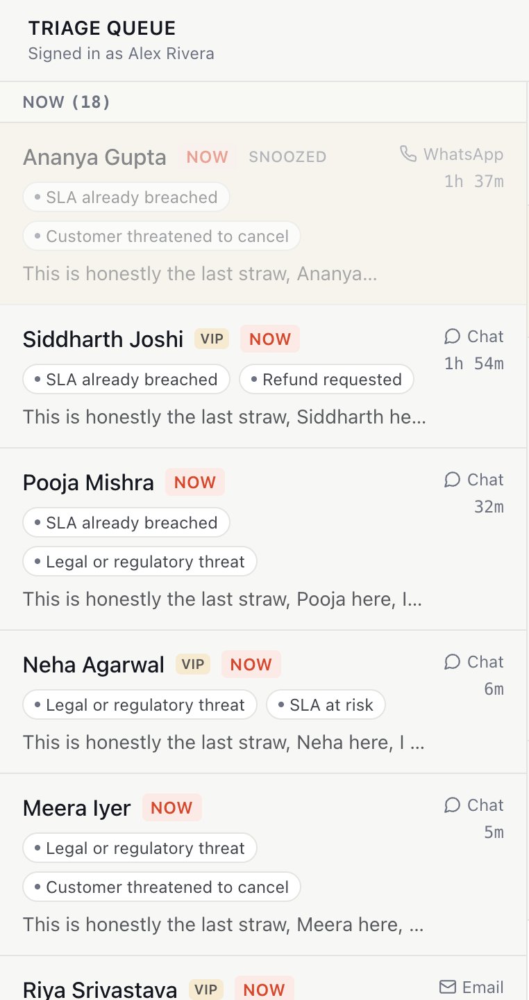
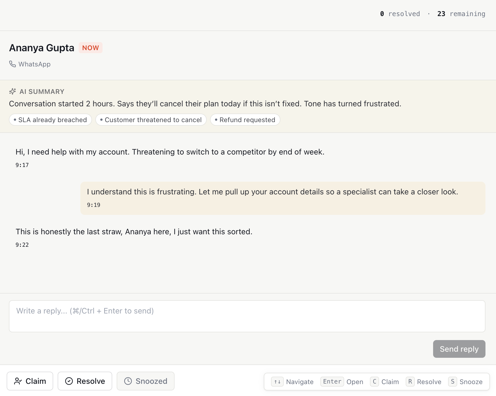

# Conversation Inbox — a triage queue for Yellow.ai CX agents

🔗 **Live Demo:** https://conversation-inbox.netlify.app/

> **Note:** The app uses a mocked backend (MSW). All data is deterministic and
> resets on refresh by design.

A focused take on the brief: not a generic inbox, but a single, fast triage
screen that tells a CX agent what to act on first and why, with an honest
(non-fabricated) view into how that priority was decided.

## Problem understanding

Yellow.ai's bots resolve most conversations. The ones that reach a human are,
by definition, the hard ones — and right now they land in an undifferentiated
queue. The cost isn't that agents can't eventually find the urgent
conversation; it's that they waste the first, highest-leverage minutes of
their shift hunting for it, and sometimes find out too late that a VIP
customer threatened to cancel an hour ago.

The user is data-literate rather than technical, working mid-shift, with a
manager asking for numbers. Success is narrow and concrete: **within seconds
of opening a full queue, know what to do first** — and by the end of the
shift, nothing important slipped through.

That reframes the assignment. The job isn't "build an inbox UI"; it's
**design the triage decision and make it inspectable**, then get out of the
way.

## Product decisions

**An urgency score, not a raw field.** Every conversation is scored from
escalation reason (refund vs. legal threat vs. complex issue), customer
tier, sentiment, and SLA time remaining — see `src/lib/urgency.ts`. The
score maps to three tiers: **Now / Soon / Later**. Agents scan tiers, not
numbers.

**Make the "why" visible, not a fake confidence score.** An earlier version
of this plan considered showing an "AI confidence: 42%" — that implies a
model producing a probability, and this queue runs on a transparent,
inspectable weighted score, not a trained classifier. Claiming false
precision would be exactly the kind of thing that falls apart the moment
someone asks "42% confident of what?" Instead, each conversation shows the
actual reasons — *SLA expiring, refund requested, VIP customer* — as small
chips, in both the row and the detail panel. That's the AI made visible,
honestly.

**Group, don't just sort.** The queue is bucketed into **Now / Soon / Later**
with sticky, counted headers, so a glance answers "how bad is my morning"
before reading a single name.

**Keyboard-first, mouse-optional.** `↑/↓` or `j/k` to move, `Enter` to open,
`C` claim, `R` resolve, `S` snooze, `Esc` to back out. Hints are shown
on-screen (bottom-right), not hidden knowledge.

**A visible end-of-shift signal.** A small "`N` resolved · `M` remaining"
strip in the header answers "did anything slip through" without needing a
manager dashboard.

## What's included

- Triage queue grouped into **Now / Soon / Later** with sticky headers,
  urgency reason chips, wait time, channel, and VIP badges
- Detail panel with AI summary above the transcript, urgency explanation,
  message thread, plain-text reply box, and claim/resolve/snooze actions
- Optimistic claim/resolve/snooze mutations with rollback and inline retry
  on failure
- Loading skeletons, empty "You're all caught up" state, and "Select a
  conversation" placeholder
- Full keyboard navigation with visible shortcut hints
- Dev-only debug panel for forcing failures, slow network, or an empty queue
- MSW mock backend with realistic 200–500 ms latency, one deterministic
  failure conversation (`conv-013`), and debug-panel toggles
- Unit tests covering urgency scoring and the mock server's failure path

## Screenshots

### Inbox



### Conversation Details



## What's intentionally excluded (and why)

- **Rich-text/attachment composer** — a plain textarea is enough to prove
  the interaction model; a full composer would distract from the triage
  experience
- **Manager analytics dashboard** — the header stats strip answers "did
  anything slip through" without building a second product
- **Multi-agent assignment/handoff** — limited to a single-agent claim flow;
  collaborative assignment is a much larger feature
- **Persistence** — no backend per the brief; state resets on refresh
  (see Known Limitations)
- **Authentication, multi-tenancy, and real-time updates** — intentionally
  out of scope for this exercise
- **Exhaustive test coverage** — tests focus on the product's core decision
  (urgency scoring) and the required failure path rather than maximizing
  coverage numbers

## Architecture

```text
src/
  types/conversation.ts     domain types (Conversation, UrgencyResult, ...)
  lib/
    urgency.ts              scoring engine — pure function, easiest place to unit test
    api.ts                  thin fetch client
    queryClient.ts          shared TanStack Query client
    time.ts                 wait-time / clock formatting
  mocks/
    data.ts                 seeded, deterministic mock data generator (~24 conversations)
    handlers.ts             MSW request handlers (GET list, PATCH status)
    debugState.ts           shared flags read by handlers, written by DebugPanel
    browser.ts              MSW browser worker setup
  hooks/
    useConversations.ts     useQuery + optimistic useMutation for status changes
    useKeyboardNav.ts       keyboard shortcut wiring, ignores typing targets
  components/               one component per concern (row, badge, panel, action bar, ...)
  App.tsx                   layout + wiring
```

**State management:** Server state (the conversation list and status
transitions) lives in TanStack Query's cache, giving the application a
single source of truth with optimistic updates and automatic rollback on
failure. UI-only state (selected conversation, reply drafts, debug toggles)
remains local or in a tiny shared store (`debugState.ts`), avoiding the
complexity of introducing a global client-state library.

**Why MSW:** It intercepts requests at the network layer, allowing the
application to interact with a real `/api/...` contract. Replacing the mock
backend with a real service later becomes a routing change rather than a UI
rewrite.

## Known limitations

- **State resets on refresh.** There is no persistence layer because the
  assignment explicitly excludes a backend.
- **Replies are local-only.** The required write path is conversation status
  changes (claim/resolve/snooze). The reply composer appends locally so the
  interaction is demonstrable without inventing an additional backend API.
- **`public/mockServiceWorker.js` is intentionally not committed.** It is a
  generated file tied to the installed MSW version. Run:

  ```bash
  npx msw init public/ --save
  ```

  once after `npm install`.
- **Please run `npm run build`, `npm run lint`, and `npm run test` after
  installation.** These are the intended verification steps and may surface
  environment-specific issues such as dependency versions or a missed import.
- Message timestamps and AI summaries are generated rather than sourced from
  a real conversational AI system.

## Setup

```bash
npm install
npx msw init public/ --save
npm run dev
npm run test
npm run build
npm run lint
```

## Trade-offs

The scoring weights in `src/lib/urgency.ts` are intentionally explicit and
easy to inspect. A production system would tune these weights using
historical SLA and resolution data, but keeping them transparent here makes
the prioritization easy to understand, discuss, and unit test.

## Future improvements

- Tune urgency weights using real historical resolution and SLA outcome data
- Make urgency weights configurable instead of hard-coded
- Persist conversation state through a real backend
- Add WebSocket support for live queue updates
- Build a separate manager-facing analytics dashboard
- Expand the reply composer with canned responses, macros, and attachments

## Approximate time spent

~10–12 hours over two evenings, including product design, implementation,
mock backend, testing, and documentation.